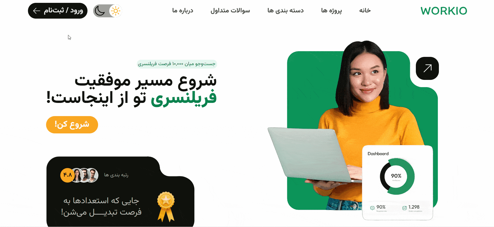
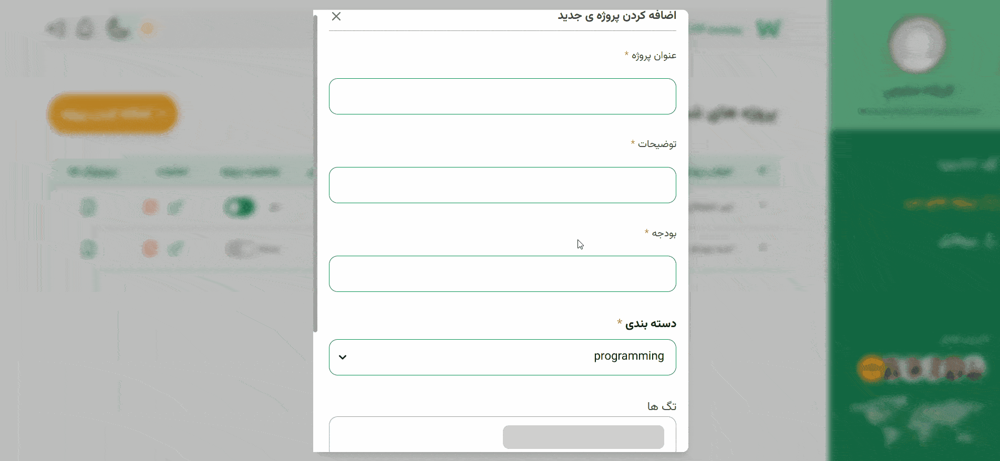
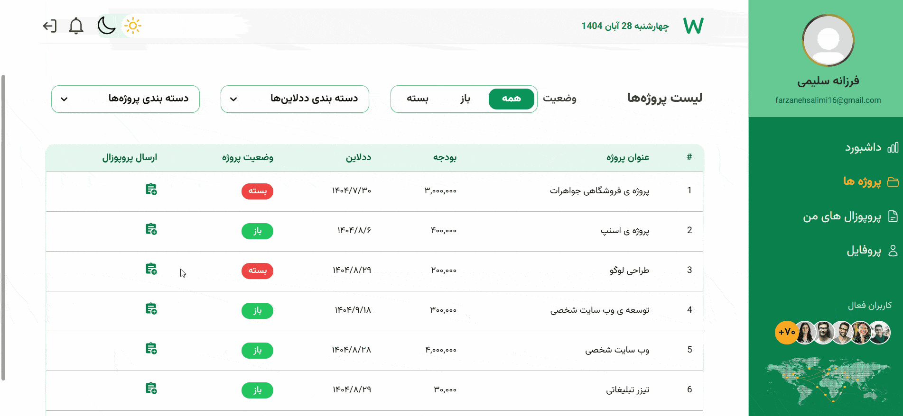
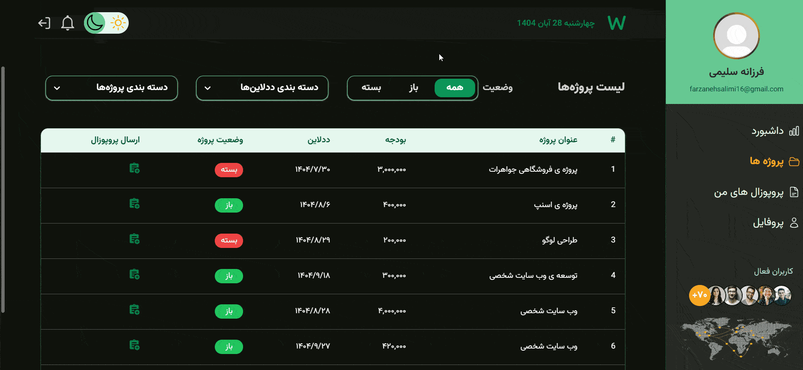

# Workio – Freelance Platform

## 📘 What is Workio?

Workio is a full-featured freelance marketplace designed with a role-based architecture, supporting three user roles: **Admin**, **Owner**, and **Freelancer**.
The platform allows project creation, proposal submissions, user verification, and full dashboard experiences for each role.

## 🔗 Live Demo

https://workio.farzanehsalimi.ir

---

This repository contains:

- `/Frontend` — React-based web application (developed by **[Farzaneh Salimi](https://farzanehsalimi.ir)**)
- `/Backend` — Node.js + MongoDB REST API server.
  The backend handles authentication, OTP logic (demo mode), role permissions, CRUD of projects/proposals, and user management.

---

## 📸 Demo GIFs & Screenshots

Below are some of the key flows of the platform:

### 🔐 1. Login & OTP Flow



### 📝 2. Creating a Project (Owner)



### 📤 3. Sending a Proposal (Freelancer)



### 🎛️ 4. Filtering Projects (Freelancer)



### 📱 5. Responsive Drawer / Sidebar


### 🏠 6. Home Page


---

## 🛠️ Prerequisites

- Node.js v14 or higher
- MongoDB running locally on default port 27017

## 🚀 Quick Start

1. Clone the repo
2. Install dependencies for frontend and backend:

```bash
cd Frontend
npm install
npm run dev

cd ../Backend
npm install
npm run dev
```

## 🔑 Environment Variables

Create a `.env` file in both folders:

### Frontend

VITE_API_URL=...

### Backend

PORT=...
MONGO_URI=...
JWT_SECRET=...
REFRESH_TOKEN_SECRET=...

## 🚀 Features

### 🔹 Authentication & Authorization

- Phone-number based login with OTP (demo mode: OTP code displayed on the page)
- Secure token-based authentication using **access tokens** (short-lived JWTs) for API requests
- **Refresh tokens** stored securely in HTTP-only cookies enable seamless session renewal without re-login
- This approach protects against XSS attacks by preventing client-side script access to tokens
- Role-based access control ensures users see only allowed resources and dashboards

---

### 🔹 Role-Based Dashboards

#### 👤 Owner

- Overview of project statistics & proposal activity
- Create projects via a modal form (React Hook Form + validation)
- Edit, delete, or close/open projects
- View proposals received for each project
- Approve or reject proposals
- Profile page

#### 🧑‍💻 Freelancer

- Dashboard showing proposals sent, accepted proposals, and wallet info
- Browse all projects created by owners
- Filter projects by:
  - Status (Open / Closed / All)
  - Category
  - Newest / Oldest
- Send proposals with dynamic form validation
- View all submitted proposals in a table with status info
- Freelancer profile

#### 🛡️ Admin

- Full control panel to manage:
  - Users (approve/reject)
  - Projects
  - Proposals
- Dedicated dashboard with statistics
- Admin profile page

---

## 🎨 UI / UX

- Fully responsive layout (mobile-first)
- Sidebar drawer for mobile screens
- Light mode & dark mode
- Smooth animations using **Framer Motion**
- Home page carousel using **Swiper**
- loading states using **react-loader-spinner**
- Custom color palette
- Persian numeral formatting for all numbers (utility functions)
- Date input for deadlines using a date picker component

---

## 🧠 State Management & Data Fetching

- **React Query** for:
  - Server state caching
  - Mutations
  - Error & loading handling
- **React Router DOM** for navigation and page routing
- Protected route system (role-based access control)

---

## 📁 Folder Architecture (Feature-Based)

Workio follows a modern _feature-driven structure_,
This architecture improves scalability, separation of concerns, and readability.

---

## 🎯 Why I Built This Project

This project demonstrates my ability to build a complete production-level Frontend with:

- Complex forms
- Data fetching + state management
- Protected routing
- Role-based UI rendering
- Responsive layouts and animations

---

## 🛠️ Tech Stack

- **React**
- **Vite**
- **React Router DOM**
- **React Query**
- **React Hook Form**
- **Tailwind CSS**
- **Framer Motion**
- **Swiper**
- **React Icons / Heroicons**
- **react-loader-spinner**
- **Custom utility functions (Persian numbers, helpers)**
- Deployment: **Vercel**

---

Crafted with care by **Farzaneh Salimi** — [farzanehsalimi.ir](https://farzanehsalimi.ir) ✨
