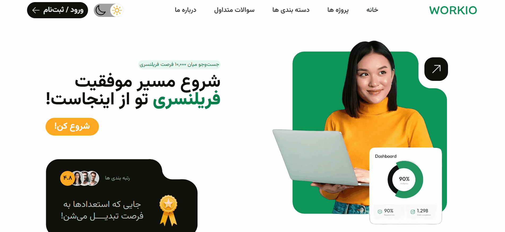
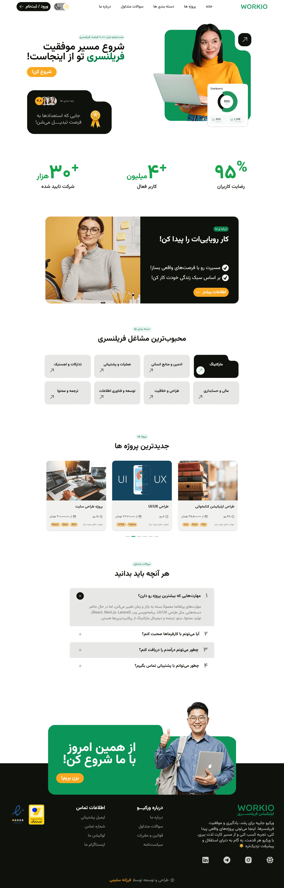
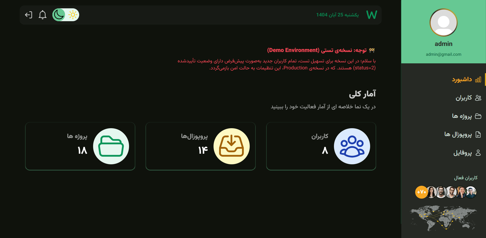
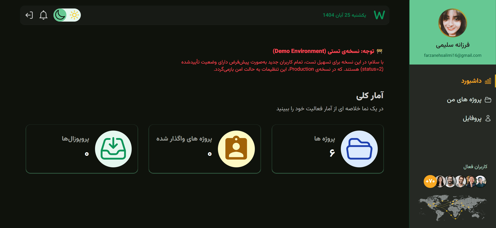
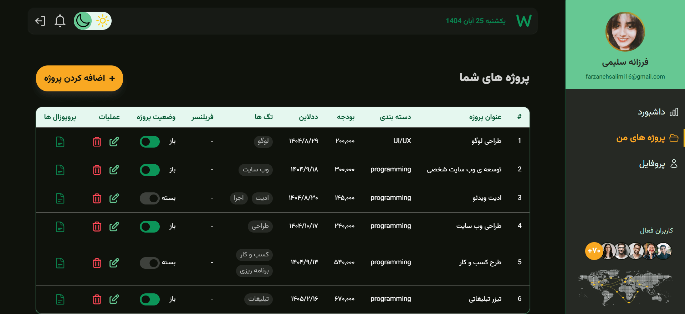
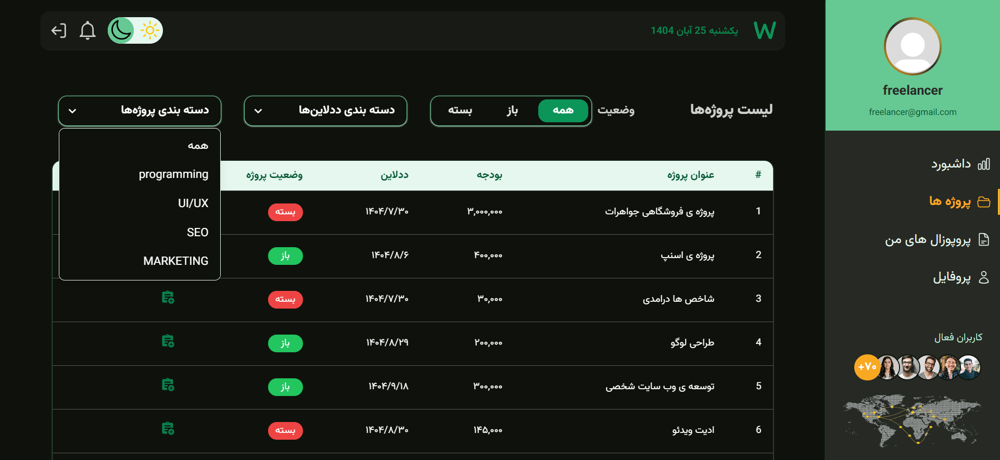
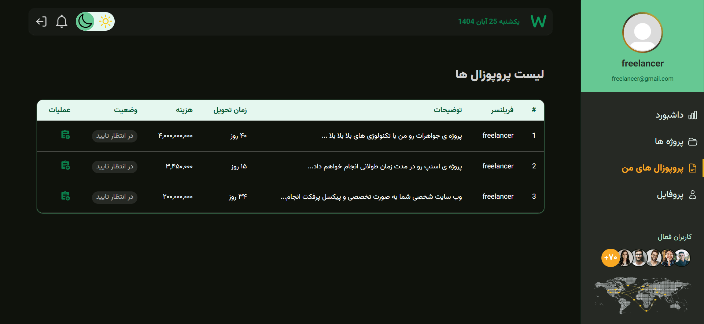

# Workio – Freelance Platform

Workio is a full-featured freelance marketplace designed with a role-based architecture, supporting three user roles: **Admin**, **Owner**, and **Freelancer**.  
The platform allows project creation, proposal submissions, user verification, and full dashboard experiences for each role.

This repository contains:

- `/frontend` — React-based web application (developed by **[Farzaneh Salimi](https://farzanehsalimi.ir)**)
- `/backend` — Node.js + MongoDB REST API server

---

## 🚀 Live Demo (Frontend)

The frontend is deployed on Vercel:  
👉 **[https://workio.farzanehsalimi.ir](https://workio.farzanehsalimi.ir)**

Backend is not deployed yet.

---

## 🎯 Core Features

### 🔹 Authentication Flow (Test Mode)

- Users enter their mobile number.
- A **test OTP code** appears above the `react-otp-input` component.
- Includes:
  - OTP countdown timer
  - Edit phone number option
  - Validation
  - Navigation to profile completion

#### GIF Demo



### 🔹 Role-Based System

Workio supports three distinct roles: **Owner**, **Freelancer**, **Admin**.

---

## 🖼 Screenshots

### 🏠 Home Page


_Home page showing featured projects and main navigation._

### 📊 Admin Dashboard – Statistics Overview


_Admin dashboard displaying platform-wide statistics and management overview._

### 📈 Owner Dashboard – Statistics Overview


_Owner dashboard showing activity statistics for projects._

### 🗂 Owner – My Projects


_Owner view of projects they have created._

### 💼 Freelancer – Available Projects


_Freelancer view of all available projects to submit proposals._

### ✉️ Freelancer – My Proposals


_Freelancer view of proposals they have submitted._

---

## 🎬 GIF Demo

### Role-Based Navigation


_Demonstrates how navigation adapts based on user role._

### Creating a Project


_Owner creating a new project._

### Submitting a Proposal


_Freelancer submitting a proposal for a project._

---

## 🛠 Tech Stack

- **Frontend:** React, Vite, TailwindCSS, React Router, React Query, React Hook Form, React Icons
- **Backend:** Node.js, MongoDB, Axios
- **Architecture:** Feature-based, role-based routing, lazy-loaded routes, centralized API layer with Axios interceptors, global error handling, full CRUD services

---

## 📁 Repository Structure

```workio-freelance-platform/
├── frontend/
├── backend/
├── assets/
└── README.md

## 👩‍💻 Developer

Frontend developed by **[Farzaneh Salimi](https://farzanehsalimi.ir)**
```
