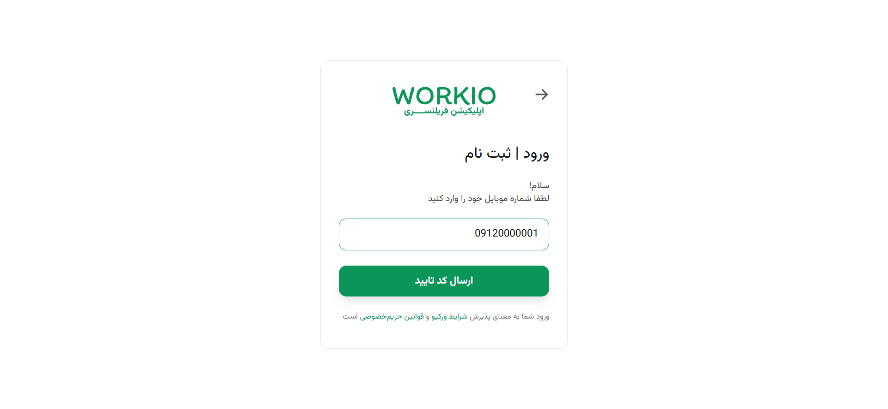
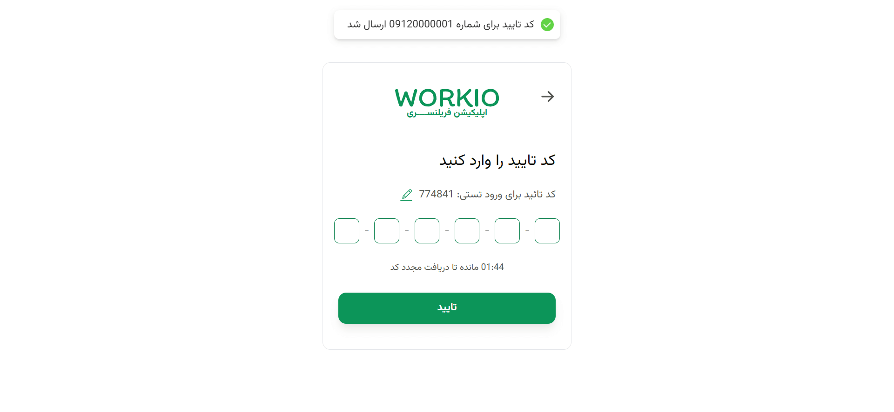

# Workio – Freelance Platform


Workio is a full-featured freelance marketplace designed with a role-based architecture, supporting three user roles: **Admin**, **Owner**, and **Freelancer**.  
The platform allows project creation, proposal submissions, user verification, and full dashboard experiences for each role.

This repository contains:

- `/frontend` — React-based web application (developed by **[Farzaneh Salimi](https://farzanehsalimi.ir)**)
- `/backend` — Node.js + MongoDB REST API server

---

## 🚀 Live Demo (Frontend)

The frontend is deployed on Vercel:  
👉 **[https://workio.farzanehsalimi.ir](https://workio.farzanehsalimi.ir)**

Backend is not deployed yet.

---

## 🎯 Core Features

### 🔹 Authentication & Authorization

- Login with mobile number and OTP (test mode)
- Role-based access: Admin, Owner, Freelancer

### 🔹 Role-Based Dashboards

- Admin dashboard for platform management
- Owner dashboard to manage projects and view proposals
- Freelancer dashboard to browse projects and submit proposals

### 🔹 Project Management

- Create, edit, and delete projects (Owner)
- Browse projects by status and category

### 🔹 Proposal System

- Submit proposals (Freelancer)
- View submitted proposals
- Manage proposals from Owner dashboard

### 🔹 User Verification

- Profile completion and user verification
- Manage personal account details

### 🔹 Notifications & Feedback

- Real-time feedback for OTP, project creation, and proposal submission

---

## 🖼 Screenshots

### 1️⃣ Home Page


_Home page showing featured projects and main navigation._

### 2️⃣ Mobile Number Input (Authentication)


_Page where users enter their mobile number for login._

### 3️⃣ OTP Verification


_Page showing OTP input, countdown timer, and navigation to profile completion._

### 4️⃣ Admin Dashboard – Statistics Overview


_Admin dashboard displaying platform-wide statistics and management overview._

### 5️⃣ Freelancer – My Projects / Proposals


_Freelancer view of available projects to submit proposals._

### 6️⃣ Owner – Adding a Project


_Owner creating or managing projects._

### 7️⃣ Freelancer – Submitting a Proposal


_Freelancer submitting a proposal for a project._

---

## 🛠 Tech Stack

- **Frontend:** React, Vite, TailwindCSS, React Router, React Query, React Hook Form, React Icons
- **Backend:** Node.js, MongoDB, Axios
- **Architecture:** Feature-based, role-based routing, centralized API layer with Axios interceptors, global error handling, full CRUD services

---

## 📁 Repository Structure

```text
workio-freelance-platform/
├── frontend/
├── backend/
├── assets/
└── README.md
```
